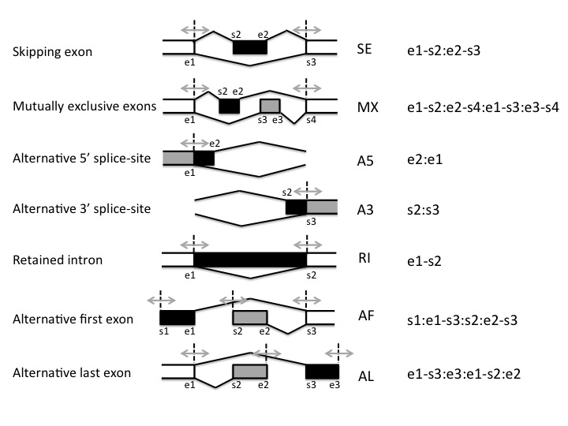

## Variant Detection (Oxford Nanopore)

## Platform

**Oxford Nanopore PromethION P2 Solo**

- Full-length transcript and isoform analysis
- Human whole genome sequencing (WGS)
- No onboard computing functionality

---

## 1. Data Generation

### Basecalling

Tools:

- MinKNOW
- Dorado

Settings:

- Basecalling: ON
- Modified Bases Detection: ON (for epigenetic information)

### Output Data

Generated files:

- POD5
- FASTQ
- BAM (contains sequence information and methylation information)

---

## 2. Data Analysis

### Workflow

**EPI2ME: wf-transcriptomes**

Required inputs:

- Reference genome (GRCh38, FASTA)
- Gene annotation (GTF)
- FASTQ or BAM file

**EPI2ME: wf-human-variation**

Required inputs:

- Reference genome (GRCh38, FASTA)
- BAM file

The workflow supports **real-time analysis**. As BAM files are generated during sequencing, the pipeline can begin analysis immediately.

### Analysis Options

- Gene expression quantification
- Transcript expression quantification
- Novel transcript discovery
- Isoform detection
- Alternative splicing analysis
- Fusion transcript detection (if present)

---

- SNVs (Single Nucleotide Variants)
- SVs (Structural Variants)
- STRs (Short Tandem Repeats / Repeat Expansions)
- CNVs (Copy Number Variations)
- Methylation / Epigenetic Analysis
- Phasing (Haplotype Phasing)

### Common Alternative Splicing Events

- Exon skipping
- Mutually exclusive exons
- Alternative 5' splice sites
- Alternative 3' splice sites
- Intron retention
- Alternative first exon
- Alternative last intron

  

### Output Files

- HTML report
- CRAM
- Transcript quantification tables
- Gene quantification tables
- Novel transcript annotations
- bedMethyl
- VCF

### Recommended Requirements

- CPUs: 32
- Memory: 128 GB

---

## 3. Reports and Visualization

### Alignment Reports

Metrics include:

- Total reads
- Read N50
- Mean coverage
- Mapping rate
- Gene counts
- Transcript counts
- Novel isoforms detected

### Variant Reports

Reports for:

- SNVs
- SVs
- STRs
- CNVs
- Methylation
- Phasing

### Visualization

**IGV (Integrative Genomics Viewer)**

Files used for visualization:

- `.cram`
- `.bw`
- `.vcf`
- Transcript annotations

Typical use cases:

- Validate splice junctions
- Inspect exon usage
- Visualize novel transcript isoforms
- Compare transcript structures between samples
